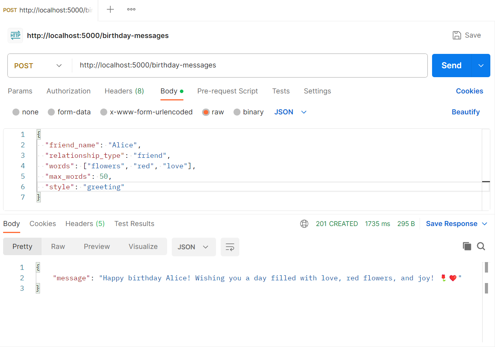
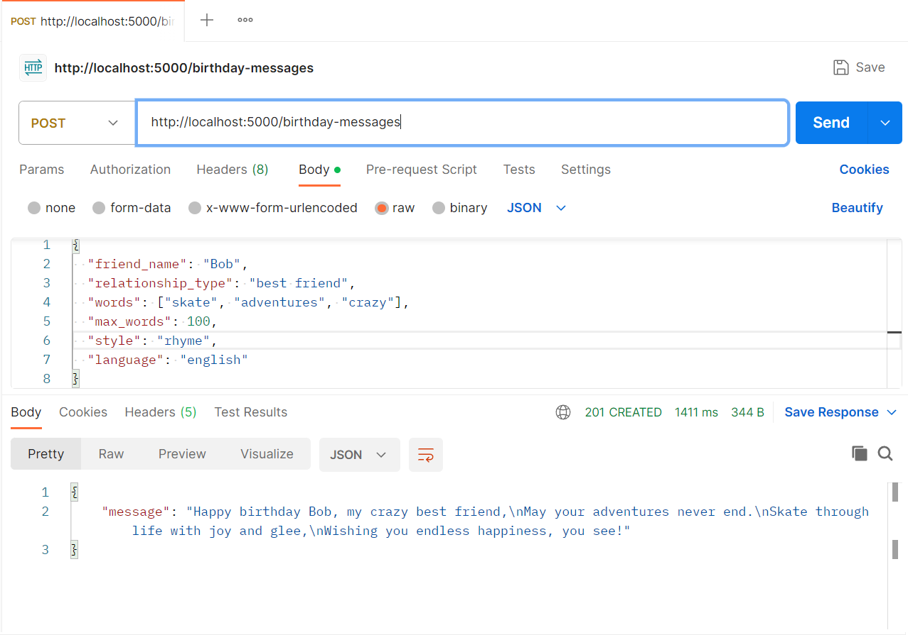
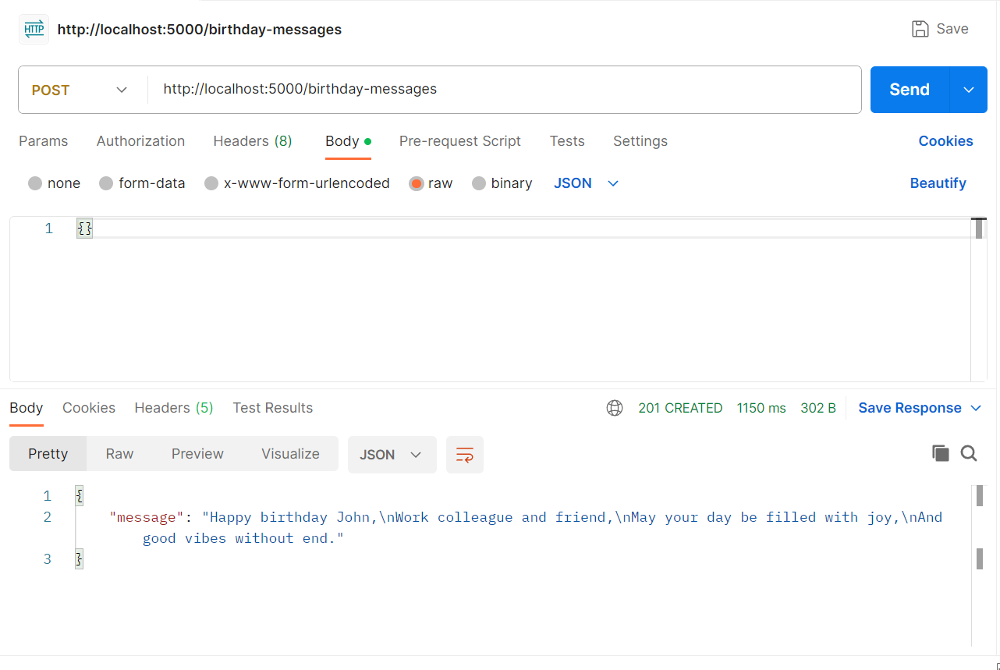
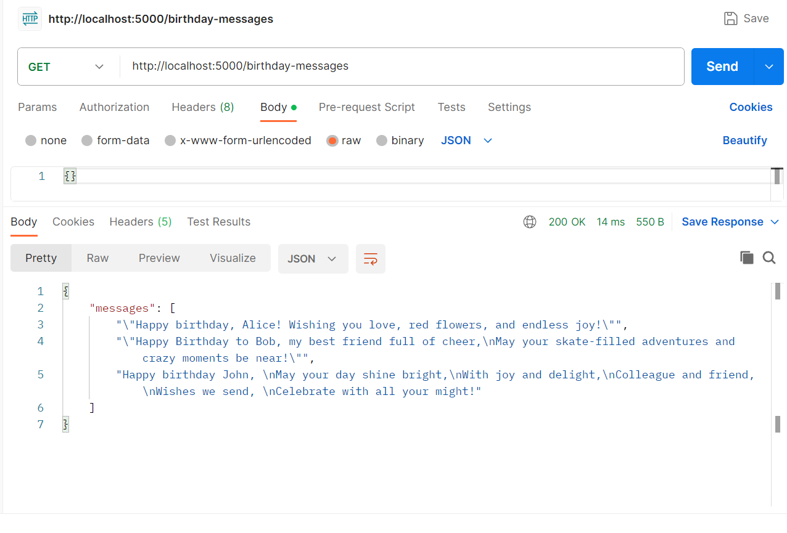
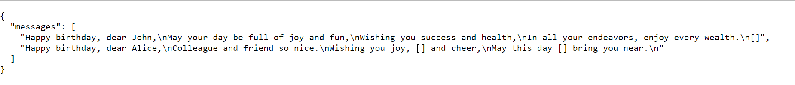
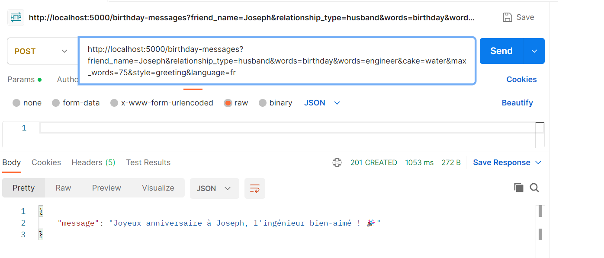
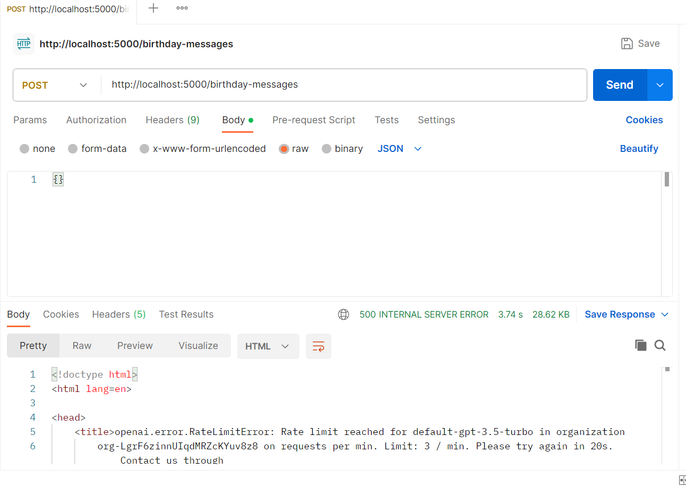
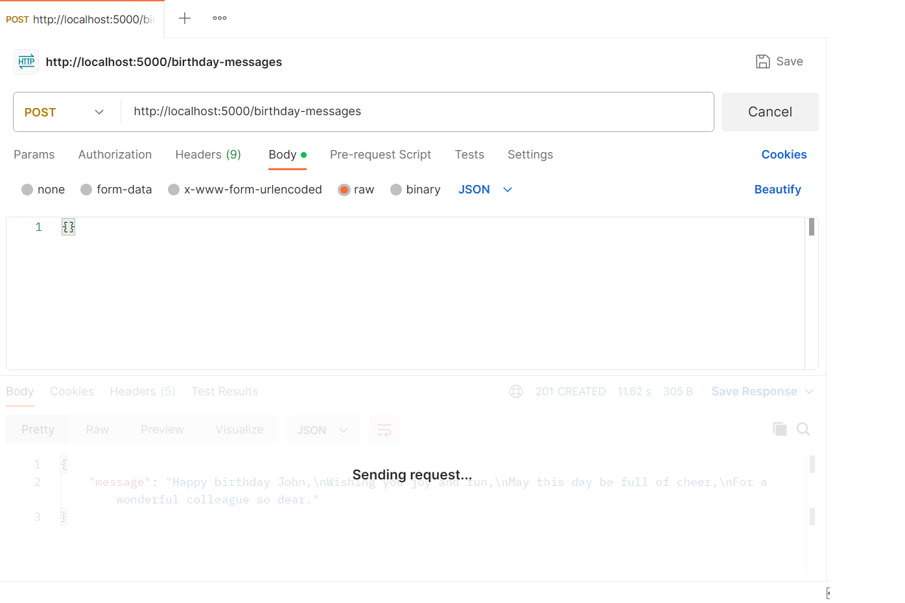

# hbd_generator
Happy birthday generator using ChatGPT OpenAI API.

The goal of this project is to develop an API that can run on localhost, so I can simulate receiving input and returning answers to a hypothetical front-end, that can be developed later as a follow-up project. This API will run on top of the OpenAI API, basically organizing distinct input in order to provide a structured command for ChatGPT. 

To start, you'll need a way to run a local server that listens for incoming HTTP requests. You can use a web framework like Flask or FastAPI for this purpose. We'll use Flask in this example.

After configuring Flask, you'll need to create an endpoint that accepts POST requests and sends them to the OpenAPI model to get a response. An alternative implementation that uses a query string instead of a JSON body can be found in the app_qs.py file.

## Running the app step by step

First, you need to set up a Flask application. You can do this by installing Flask if you haven't already:

```pip install Flask```

Now, check the app.py file for the basic server configuration, make the necessary adjustments if any, and kick off the server with the ```python app.py``` command. Your Flask app will start on localhost at the default port 5000.

Accessing localhost in port 5000 directly will return an error, given that there is no defined route for this URL. However, it should be possible to access the defined route http://localhost:5000/birthday-messages which will by default make a GET request as this is what browsers are usually for.

Finally, to test it with Postman, send a POST request to http://localhost:5000/birthday-messages with JSON data containing the parameters you want to use for generating the message. It is possible to configure the following variables:

- friend_name
- relationship_type
- words to be included in the message
- maximum number of words
- style
- language for the message

Please see the examples below for illustrative purposes:

**Example 1 - Alice**
```
{
  "friend_name": "Alice",
  "relationship_type": "friend",
  "words": [
    "flowers", 
    "red", 
    "love"],
  "max_words": 50,
  "style": "greeting"
}
```



**Example 2 - Bob**
```
{
    "friend_name": "Bob",
    "relationship_type": "best friend",
    "words": [
        "skate",
        "adventures",
        "crazy"
    ],
    "max_words": 100,
    "style": "rhyme",
    "language": "english"
}
```



If any of these values are not specified, defaults will be used to fill out the missing details, as in this empty JSON string example that defaults to a poem for a work colleague named John.



Finally, it is possible to use the GET method to retrieve previously generated HBD messages. This might be useful in case the user generates multiple messages in a row and wants to go back to a previously generated version, for example.



The list of results can also be retrieved directly from the browser, which operates with GET requests by default as mentioned above. A different list of examples was retrieved above by accessing http://localhost:5000/birthday-messages directly.



## Alternative implementation

The app_qs.py file follows the same implementation, but with a slightly modified code that allows the users to use query string parameters instead of sending a JSON body.

A test can be made by sending a POST request to the endpoint as follows:

```
http://localhost:5000/birthday-messages?friend_name=Joseph&relationship_type=husband&words=birthday&words=engineer&cake=water&max_words=75&style=greeting&language=fr
```



Query string implementations are useful for use cases when there is a need for simple and transparent information. They can also be easily cached by intermediaries like proxy servers, which can improve performance and reduce server load for frequently accessed resources. In addition to this, query string URLs can be bookmarked by end users, which is helpful for saving specific views, filters, and search results. However, for more complex data structures, larger volumes of data, and sensitive information, JSON body is the go-to option.

## Authentication and Authorization

Basic API_key authorization was added to the project, making it necessary to add the key 'Authorization' and one of the API Keys inside the auth.cfg file as a value for successfully completing requests. API Key authentication is less secure for user-specific authentication because they are typically long-lived and can be easily shared, but are suitable for simple, low-security scenarios and public APIs that don't require user-specific access. Therefore, they are a great option for providing access to the entire API when there is no need for fine-grained permissions.

## Rate Limit and Throttling

This project uses flask rate limite library. To install, execute the command below:

```
pip install Flask-Limiter
```

Using Flask-Limiter is as easy as adding the @limiter.limit decorator with the limiting expression as a string on top of each endpoint, example: @limiter.limit("10 per minute"). The greatest advantage of rate limiting calls for this project is that as credits for my ChatGPT API Key are limited, I would like to avoid a single user to drain all of the credits by making multiple calls in a short time window. The result of multiple calls after the rate limit implementation can be seen below:



Throttling is a mechanism that limits the rate at which requests are processed or served by an API. While rate limiting restricts the number of requests a client can make within a specific time window, throttling controls how frequently the server processes or serves those requests. Throttling ensures that even if a client has a high rate limit, they cannot overwhelm the server with rapid, consecutive requests.

To avoid receiving these consecutive calls or sending the rate limit error message, a basic throttling mechanism was implemented. The result is that the API takes longer to answer, which can be observed in Postman by the increased time "Sending request..." is kept on the screen.



## Front-end with Streamlit

Streamlit is a pure python library that can be used to develop front-end elements.

```
pip install streamlit
```

The streamlit_app.py file in this directory can be run with the following command:

```
streamlit run streamlit_app.py
```

## Next steps

The goal of this project was simply to try out ChatGPT API, but I decided to list a suggestion of the next steps for those who want to build on the code I have already created or for my future self:

1. Improve validation and error handling 
2. Data persistence
3. Advanced user authentication and authorization with JWT
4. API documentation

