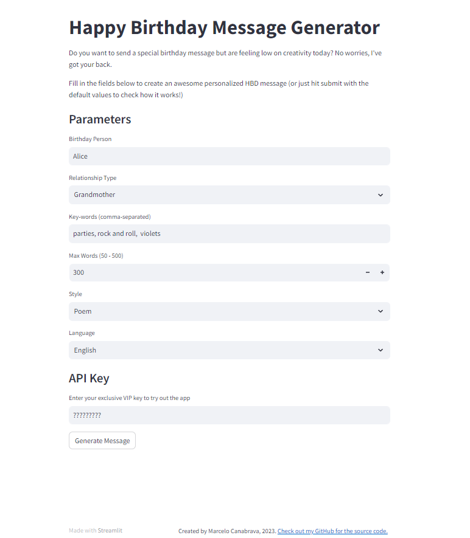
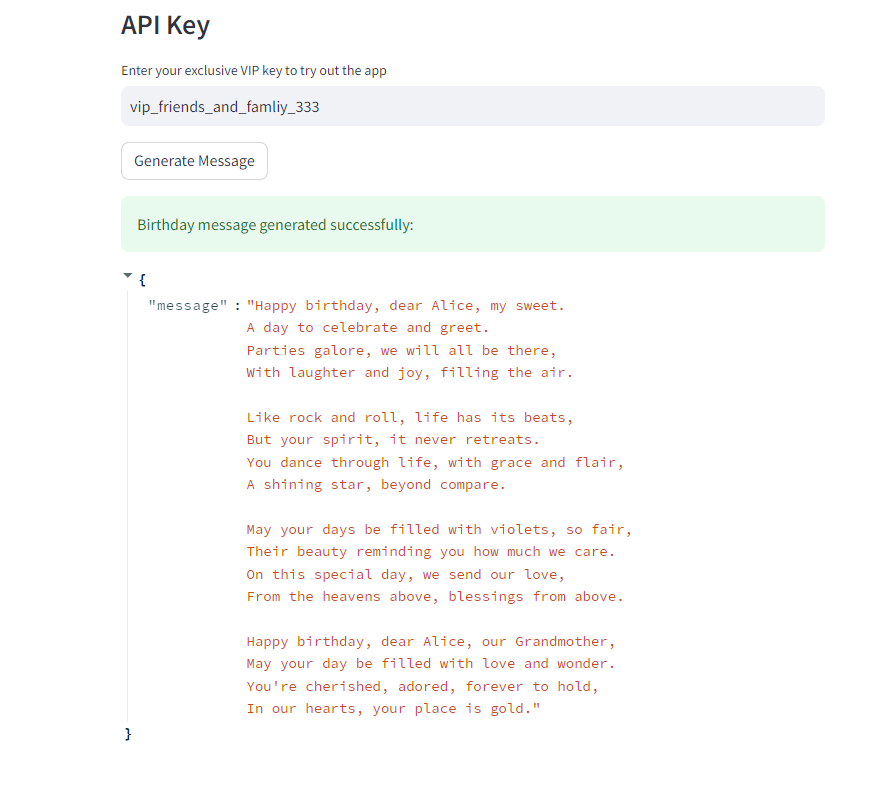

# hbd_generator
Happy birthday generator using ChatGPT OpenAI API and Streamlit.

The goal of this project is to develop an API that is capable of receiving input from a front-end, sending this input to ChatGPT API and returning an answer to the front-end. 

**This repository contains only the front-end portion of the code as the API was designed to work as a different service. To access the API repository, [click here](https://github.com/mcanabrava/hbd-generator-api/tree/main).**

The end result can be seen in the images below, but for a better understanding it is highly recommended to watch my [Loom Demo.](https://www.loom.com/share/c84191f941c648db96306447fcd258a1)

Check the example below for Grandmother Alice, who likes rock and roll, parties and violets very much:



And the response message:




## Front-end with Streamlit

Streamlit is a pure python library that can be used to develop front-end elements.

```
pip install streamlit
```

The streamlit_app.py file in this directory can be run with the following command:

```
streamlit run streamlit_app.py`
```

## Next steps

The goal of this project was simply to try out ChatGPT API, but I decided to list a suggestion of the next steps for those who want to build on the code I have already created or for my future self:

1. Improve validation and error handling 
2. Data persistence
3. Advanced user authentication and authorization with JWT
4. API documentation

